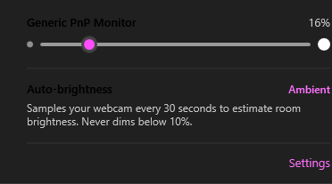
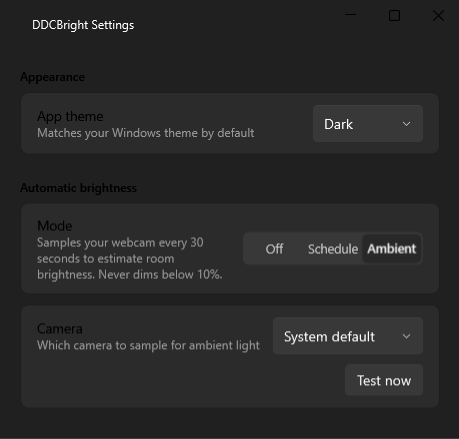
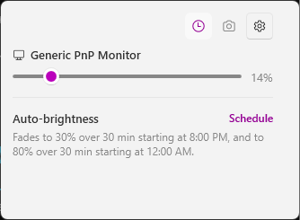
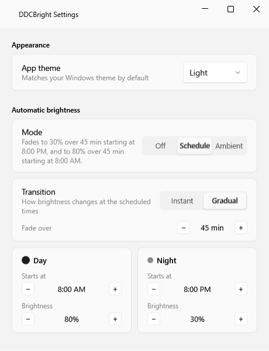

# DDCBright

Screen brightness, actually controlled. A native Windows tray app for DDC/CI
monitor brightness — no Electron, no bundled runtime, just a real Mica
flyout that matches your Windows theme and gets out of your way.

<table>
<tr>
<td></td>
<td></td>
</tr>
<tr>
<td></td>
<td></td>
</tr>
</table>

## Features

- **Flyout** — click the tray icon, drag a slider per monitor, done. Scroll over the tray icon to nudge brightness without even opening it.
- **Schedule** — dim in the evening, brighten in the morning, with an optional gradual fade instead of an instant jump.
- **Ambient** — samples your webcam every 30 seconds and estimates room brightness instead of following a fixed clock. Never dims below 10%, and Settings has a camera picker plus a one-click "Test now" to check it's actually reading your camera.
- **Native UI** — real Mica/Acrylic, matches your Windows light/dark theme and accent color, not a repainted cross-platform toolkit window.
- **Quiet** — registers its own autostart at login on first run; no installer nagging, no background service beyond the tray icon itself.

## Install

Grab an asset from [Releases](https://github.com/mvrck19/ddcbright/releases):

- **Installer** — download `ddcbright-setup.exe` and run it. Adds a Start Menu shortcut and a proper Add/Remove Programs entry. No admin rights needed (installs to your user profile).
- **Portable** — download `ddcbright.exe` and run it directly. Self-contained, nothing to install, nothing left behind but the autostart entry it registers on first run.

## Troubleshooting

- Make sure your monitor supports DDC/CI and it's enabled in the monitor's OSD menu — DDC/CI access uses the OS's own display API, no extra setup needed on Windows.
- Ambient mode not reacting? Open Settings → Ambient → **Test now** to see exactly what the camera captured, or check `%AppData%\ddcbright\ambient.log` for a per-attempt history.
- App crashed? Check `%AppData%\ddcbright\crash.log` — every unhandled exception is written there (and, in Release builds with Sentry configured, reported to Sentry too). See [Diagnostics](#diagnostics) below.

## Linux (secondary)

A separate Python/PyQt5 implementation lives in `ddcbright/`, built on [`monitorcontrol`](https://github.com/newAM/monitorcontrol) for DDC/CI. It gets less attention than the Windows app.

```bash
sudo dpkg -i ddcbright.deb && pip install monitorcontrol   # not packaged for apt
# or
flatpak install ddcbright.flatpak
```

Needs `i2c` group access: `sudo usermod -aG i2c $USER`, then log out and back in. macOS isn't supported (`monitorcontrol` has no macOS backend).

## Testing & performance

The Windows app has three layers of automated checks, all under `windows/`:

- `dotnet test windows/DdcBright.Tests` — unit tests for the pure logic (schedule/fade math, the debounce collapsing behavior, ambient-light brightness mapping, and the tray-scroll hook's decision logic).
- `dotnet test windows/DdcBright.UiTests` — end-to-end tests that drive the real Settings window via FlaUI/UI Automation.
- `dotnet run -c Release --project windows/DdcBright.Benchmarks` — [BenchmarkDotNet](https://benchmarkdotnet.org/) microbenchmarks for the hot paths, headlined by the tray-icon scroll hook's callback logic; see [`windows/DdcBright.Benchmarks/README.md`](windows/DdcBright.Benchmarks/README.md). Local/manual only — not run in CI, since statistical benchmarks need a quiet machine to mean anything.

One fix worth calling out: `TrayIconScrollHook` installs a global low-level Windows mouse hook (needed to catch scroll-over-tray-icon), which Windows serializes *all* system mouse input through — if its owning thread stalls (e.g. suspended at a debugger breakpoint), the whole desktop's mouse input can stall with it. The app now skips installing that hook whenever a debugger is attached, so an edit/rebuild/relaunch cycle in Visual Studio can't trigger it.

## Diagnostics

Two always-on pieces, both in Release builds:

- **Crash reporting** (`CrashReporting.cs`) — every unhandled exception (WPF UI thread, AppDomain, or an unobserved `Task`) is written to `%AppData%\ddcbright\crash.log` and, if a Sentry DSN is configured, reported to [Sentry](https://sentry.io) (free Developer tier — 5K events/month is far more than a single-user desktop app needs). To enable Sentry, create a project at sentry.io and paste its DSN into the `Dsn` constant in `CrashReporting.cs`; leave it blank to keep crash reporting local-only. Either way, set `DDCBRIGHT_DISABLE_SENTRY` (any value) to opt out of Sentry specifically while keeping the local log.
- **Performance data** (`DdcBrightEventSource.cs`) — an ETW provider named `DdcBright`, with Start/Stop events around the hot paths that matter most for a DDC/CI app: the hardware brightness get/set calls, the schedule-fade tick, and ambient-light luma computation. Near-zero cost when nothing's listening; capture it with:
  ```powershell
  dotnet-trace collect --process-id <pid> --providers DdcBright
  ```
  then inspect the resulting `.nettrace` via `dotnet-trace convert --format speedscope` (open in speedscope.app) or PerfView.

## Contributing

Contributions are welcome! Please feel free to submit a Pull Request.

For changes to the Windows app, run the unit tests (`dotnet test windows/DdcBright.Tests`) and the UI tests (`dotnet test windows/DdcBright.UiTests/DdcBright.UiTests.csproj`) before opening a PR.

## License

[MIT](LICENSE)
